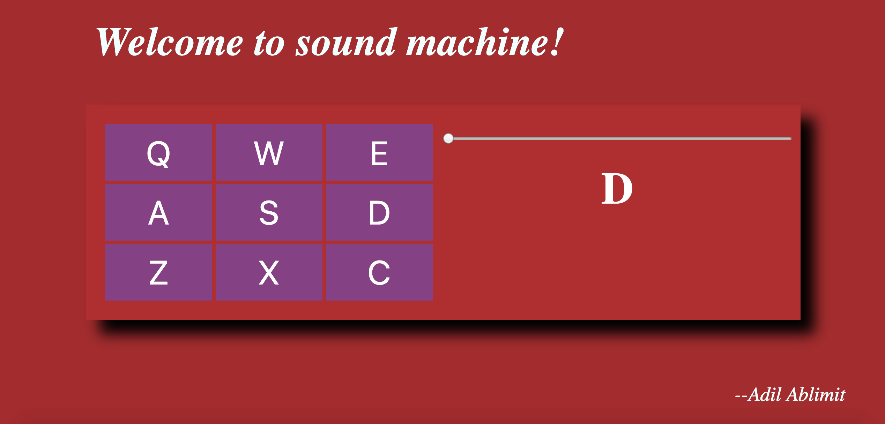

<h1 style="color:blue;text-align:center;">Project 2: Sound Machine</h1>
<h2>Project Link: <a href='https://elated-chandrasekhar-3baa23.netlify.com/'><i>here</i></a></h2>

final version example

This project is created using React.
<pre>  User can display different sounds by clicking mouse and keyboard.
Right side screen display the current letter.
User can set the volume by changing the input range.
     
</pre>
